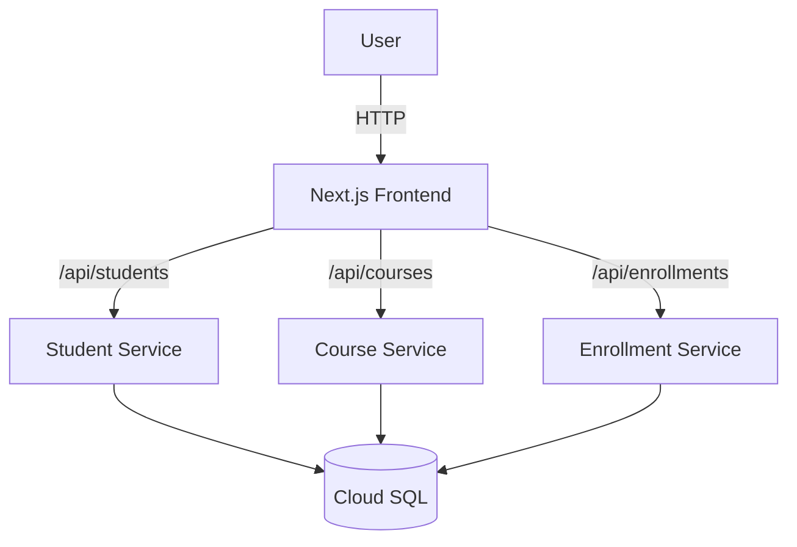

# EduTrack: Microservices Learning Platform

EduTrack is a cloud-native microservices application deployed on Google Kubernetes Engine (GKE). It allows students to manage profiles, browse courses, and handle enrollments through a distributed system architecture.


## 🚀 Features

*   **Student Management**: Create and view student profiles.
*   **Course Catalog**: Browse, search, and view course details.
*   **Enrollments**: Real-time enrollment system ensuring capacity limits.
*   **Microservices Architecture**: Independently deployable services for Students, Courses, and Enrollments.
*   **Cloud Native**: Fully containerized with Docker and orchestrated via Kubernetes.

## 🛠️ Technology Stack

*   **Frontend**: Next.js (React), Tailwind CSS
*   **Backend**: Node.js, Express
*   **Database**: PostgreSQL (Google Cloud SQL)
*   **DevOps**: Docker, Kubernetes (GKE), Google Cloud Platform

## 🏗️ Architecture

The system consists of a Next.js Frontend and three backend microservices, all communicating via REST APIs. Data is persisted in a managed Cloud SQL instance.



## 📋 Prerequisites

*   Node.js 20+
*   Docker
*   Google Cloud SDK (`gcloud`)
*   `kubectl`

## ⚙️ Local Development

1.  **Clone the repository**
    ```bash
    git clone https://github.com/fssandhu007/edu-track.git
    cd edu-track
    ```

2.  **Install dependencies**
    ```bash
    npm install
    ```

3.  **Run Locally (Frontend)**
    ```bash
    npm run dev
    ```

4.  **Run Microservices (Docker Compose)**
    *Alternatively, you can run the services using Docker Compose.*
    ```bash
    docker-compose up --build
    ```

## ☁️ Deployment

The project includes scripts to automate deployment to GKE.

1.  **Build and Push Images**
    ```bash
    ./scripts/build_and_push.sh
    ```

2.  **Deploy Manifests**
    ```bash
    kubectl apply -f infra/
    ```

3.  **Deploy Frontend**
    ```bash
    ./scripts/deploy_frontend.sh
    ```

## 📂 Project Structure

*   `app/` - Next.js Frontend application
*   `edutrack/student-service` - Node.js Student Microservice
*   `edutrack/course-service` - Node.js Course Microservice
*   `edutrack/enrollment-service` - Node.js Enrollment Microservice
*   `edutrack/infra` - Kubernetes YAML manifest files
*   `edutrack/scripts` - Deployment and utility scripts

## 📄 License

This project is licensed under the MIT License.
